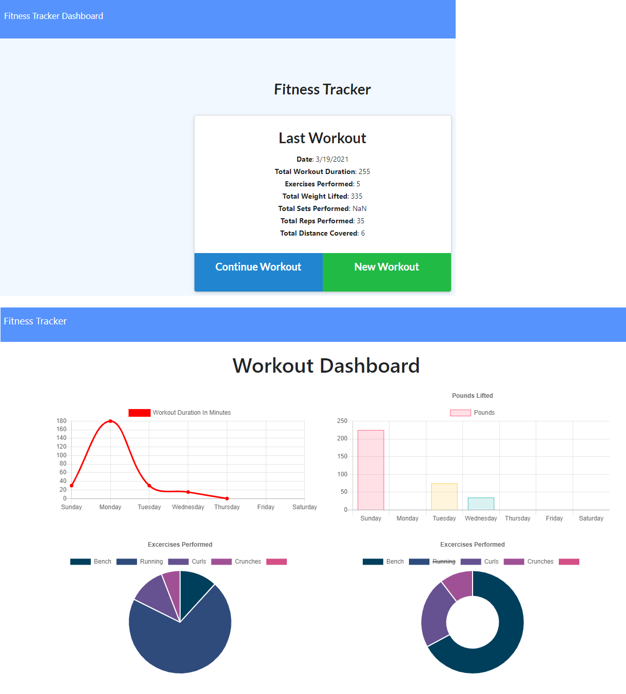

# u17-workout-tracker
## A fitness tracker with past 7 day stats.

### Description 

This application backend was created to complete the front end code for homework 17 of the UW FSF Coding Bootcamp.

The application tracks your workouts you enter, and then displays the past 7 days of workouts on a stats page.

You can start a workout, and then add exersices to that workout as resistance or cardio training, with duration, reps, weight, and/or distance.

### Img of Heroku Deployment

### Links

[Deployed Application](https://u17-workout-traker.herokuapp.com/)

[GitHub Repo](https://github.com/epowelldev/u17-workout-tracker)